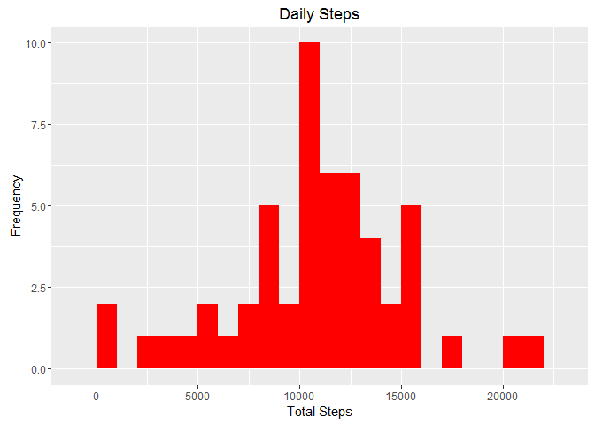
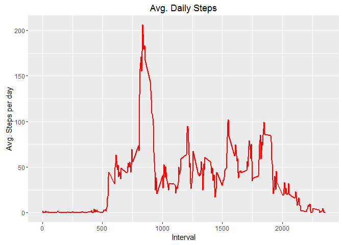
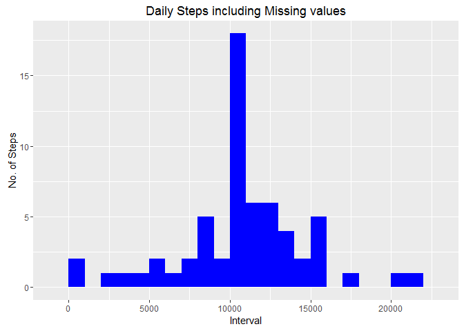
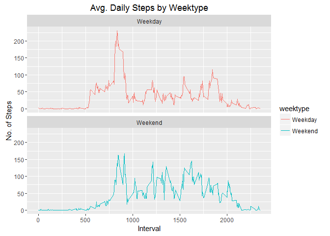

# Reproducible Research: Peer Assessment 1


## Loading and preprocessing the data
##### 1. Load the data (i.e. read.csv())

```r
data <- read.csv('./activity.csv')
```


##### 2. Process/transform the data (if necessary) into a format suitable for your analysis

```r
data$date<- as.Date(data$date)
```

## What is mean total number of steps taken per day?
##### 1.Calculate the total number of steps taken per day:

```r
TSteps<- data%>%
  group_by(date)%>%
  filter(!is.na(steps))%>%
  summarise(tsteps = sum(steps, na.rm=TRUE))
```

##### 2. Make a histogram of the total number of steps taken each day:

```r
library(ggplot2)
ggplot(TSteps, aes(x = tsteps)) +
  geom_histogram(fill = "red", binwidth = 1000) +
  labs(title = "Daily Steps", x = "Total Steps", y = "Frequency")
```

\

##### 3. Calculate and report the mean and median of the total number of steps taken per day:

```r
Mean_Steps<- mean(TSteps$tsteps, na.rm=TRUE)
Mean_Steps
```

```
## [1] 10766.19
```

```r
Median_Steps<- median(TSteps$tsteps, na.rm=TRUE)
Median_Steps
```

```
## [1] 10765
```

##What is the average daily activity pattern?
##### 1. Calculating Avg. Steps:

```r
Interval<- data%>%
  group_by(interval)%>%
  filter(!is.na(steps))%>%
  summarise(avg_steps = mean(steps, na.rm=TRUE))
```


##### 1.1 Plotting Avg. Steps:

```r
ggplot(Interval, aes(x =interval , y=avg_steps)) +
  geom_line(color="red", size=1) +
  labs(title = "Avg. Daily Steps", x = "Interval", y = "Avg. Steps per day")
```

\

##### 2. Which 5-minute interval, on average across all the days in the dataset, contains the maximum number of steps?

```r
Interval[which.max(Interval$avg_steps),]
```

```
## Source: local data frame [1 x 2]
## 
##   interval avg_steps
##      (int)     (dbl)
## 1      835  206.1698
```


##Imputing missing values
##### 1.Calculate and report the total number of missing values in the dataset:

```r
sum(is.na(data$steps))
```

```
## [1] 2304
```

##### 2. Imputing missing values using mean for each day and Create a new dataset that is equal to the original dataset but with the missing data filled in:

```r
data2<- data
nas<- is.na(data2$steps)
avg_interval<- tapply(data2$steps, data2$interval, mean, na.rm=TRUE, simplify = TRUE)
data2$steps[nas] <- avg_interval[as.character(data2$interval[nas])]
names(data2)
```

```
## [1] "steps"    "date"     "interval"
```


##### 3. Check if no missing value is appearing:

```r
sum(is.na(data2))
```

```
## [1] 0
```

```r
data2<- data2[, c("date", "interval", "steps")]# reorder columns 
```


#### 4.1 Create histogram of the total number of steps taken each day :

```r
TSteps2<- data2%>%
  group_by(date)%>%
  summarise(tsteps = sum(steps, na.rm=TRUE))
  ggplot(TSteps2, aes(x = tsteps)) +
    geom_histogram(fill = "blue", binwidth = 1000) +
    labs(title = "Daily Steps including Missing values", x = "Interval", y = "No. of Steps")
```

\


###### 4.2 Do these values differ from the estimates from the first part of the assignment? What is the impact of imputing missing data on the estimates of the total daily number of steps?

```r
 Mean_Steps2<- mean(TSteps2$tsteps, na.rm=TRUE)
  Mean_Steps2
```

```
## [1] 10766.19
```

```r
  Median_Steps2<- median(TSteps2$tsteps, na.rm=TRUE)
  Median_Steps2
```

```
## [1] 10766.19
```

 

##Are there differences in activity patterns between weekdays and weekends?
###### 1. Create a new factor variable in the dataset with two levels - "weekday" and "weekend" indicating whether a given date is a weekday or weekend day.

```r
  data2<- data2%>%
    mutate(weektype= ifelse(weekdays(data2$date)=="Saturday" | weekdays(data2$date)=="Sunday", "Weekend", "Weekday"))
```

###### 2 Make the panel Plot:

```r
 Interval2<- data2%>%
    group_by(interval, weektype)%>%
    summarise(avg_steps2 = mean(steps, na.rm=TRUE))
  
  plot<- ggplot(Interval2, aes(x =interval , y=avg_steps2, color=weektype)) +
    geom_line() +
    labs(title = "Avg. Daily Steps by Weektype", x = "Interval", y = "No. of Steps") +
    facet_wrap(~weektype, ncol = 1, nrow=2)
  print(plot)
```

\

 
  
